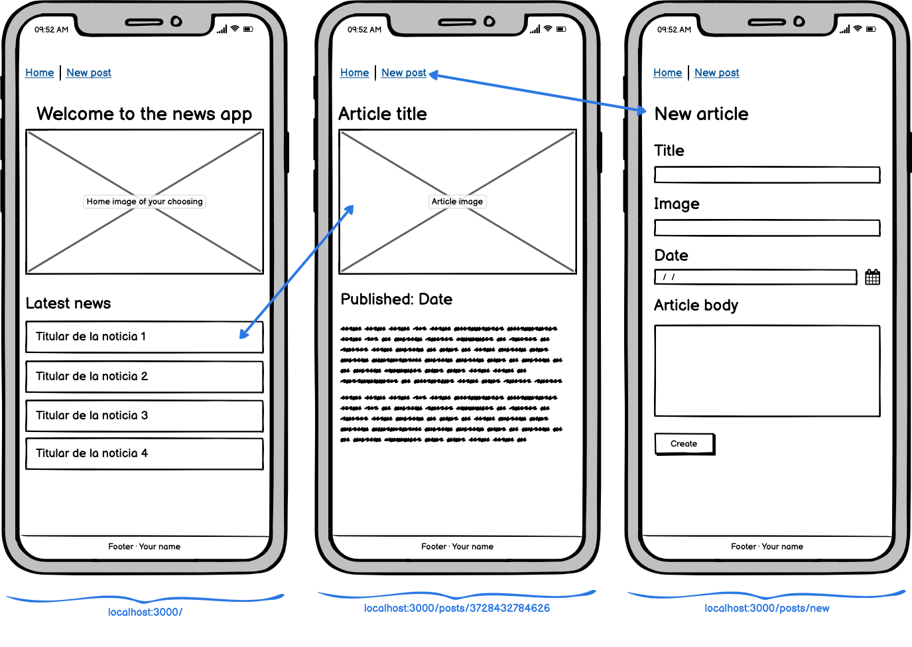

# App COURSE4u

## Description

COURSE4u is a cutting-edge online learning platform that provides users with a comprehensive and dynamic learning experience. With the ability to browse, explore, and register for courses, as well as add courses to their favorites and leave reviews, COURSE4u is poised to revolutionize the world of online education. Join the community of learners today and take your education to the next level!"

---

## Instructions

When cloning the project, change the <code>sample.env</code> for an <code>.env</code> with the values you consider:
```js
PORT=3000
MONGO_URL='mongodb://localhost:27017/app-name'
SESSION_SECRET='SecretOfYourOwnChoosing'
NODE_ENV='development'
```
Then, run:
```bash
npm install
```
To start the project run:
```bash
npm run start
```

To work on the project and have it listen for changes:
```bash
npm run dev
```

---

## Wireframes
Substitute this image with an image of your own app wireframes or designs



---

## User stories (MVP)

What can the user do with the app?
- User can sign up and create and account
- User can login
- User can log out
- User can upload a profile picture
- User can edit profile (username, name)
- User can choose the courses. 
- User see profile account
- User has an account with their courses ( my courses)
- User can add review
- User can see the course's review

## User stories (Backlog)

- User can edit deadline course
- user can filter by certified courses 
- user can select categories (Model - type (subcategory))
- user can subscribe- pay a monthly fee to access the course)
- user can change password
- User can login with google and facebook
- user can contact support via chat- predefined automatic message


---

## Models

User:

```js
const userSchema = new Schema(
  {
    username: {
      type: String,
      trim: true,
      required: [true, 'Username is required.'],
      unique: true
    },
    email: {
      type: String,
      required: [true, 'Email is required.'],
      unique: true,
      lowercase: true,
      trim: true
    },
    hashedPassword: {
      type: String,
      required: [true, 'Password is required.']
    }
  },
  {
    timestamps: true
  }
);

Course:

const courseSchema = new Schema(
  {
    title: {
        type: String,
        required: true
    },
    description: {
        type: String,
        required: true
    },
    subcategories:{
        type: String,
        required: true
    },
    image:{
        type: String,
        required: true
    },
    price:{
        type: Number,
        required:true
    },
    certificate:{
        type: Boolean,
        required: true
    },
    duration:{
        type: String,
        required: true
    },
    timestamps: {}
  }
);

Review:

const reviewSchema = new Schema(
  {
    stars: {
        type: Number,
        required: true,
        min: 0,
        max: 5
      },
      comment: {
        type: String
      },
      username: {
        type: String
      },
      show: {
        type: Schema.Types.ObjectId, // Solo uno
        ref: 'Course'
      }
    })

---

## Routes

| Name  | Method | Endpoint    | Protected | Req.body            | Redirects |
|-------|--------|-------------|------|---------------------|-----------|
| Home  | GET   | /           | No   |                     |           |
| Login | GET    | /auth/login | No |                      |           |
| Login | POST | /auth/login   | No | { email, password }  | /         |
| Signup | GET    | /auth/signup | No |                      |           |
| Signup | POST | /auth/signup   | No | { username, email, password }  | /auth/login  |
| New movie  | GET    | /movies/new | Yes |                      |           |
| New movie | POST | /movies/new   | Yes | { title, cast, genre }  | /movies/:movieId   |

---

## Useful links

- [Github Repo]()
- [Trello kanban]()
- [Deployed version]()
- [Presentation slides](https://www.slides.com)


