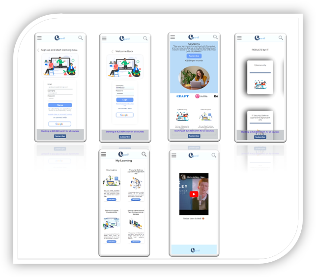

# App COURSE4u

## Description

COURSE4u is a state-of-the-art online learning platform developed by Monica Camargo and Andrea García. It provides users with a comprehensive and dynamic learning experience, offering the ability to browse, explore (search), and subscribe as a premium member for courses, as well as add courses to their Account and leave reviews. Course4u also provides the admin interface that can create new courses, edit current ones, and delete them. 




---

## Instructions

When cloning the project, change the <code>sample.env</code> for an <code>.env</code> with the values you consider:

```js
PORT = 3000;
MONGO_URL = "mongodb://localhost:27017/app-name";
SESSION_SECRET = "SecretOfYourOwnChoosing";
NODE_ENV = "development";
```

Then, run:

```bash
npm install
```

To start the project run:

```bash
npm run start
```

To work on the project and have it listen for changes:

```bash
npm run dev
```

---

## Wireframes

Substitute this image with an image of your own app wireframes or designs


---

## User stories (MVP)

What can the user do with the app?

- User can sign up and create and account
- User can login
- User can log out
- User can change password
- User can login with google
- User can upload a profile picture
- User can edit profile (username, name)
- User can choose the courses.
- User see profile account
- User has an account with their courses ( my courses)
- User can add review
- User can delete review
- User can see the course's review
- User can search courses
- User can subscribe- pay a monthly fee to access the course)
- User can subscribe by filling in checkout page and pay the monthly fee.
- WebApp responsive

What can the user(Admin) do with the app?

- Admin can edit courses.
- Admin can delete courses.
- Admin can add new courses.

## User stories (Backlog)

- User can edit deadline course
- user can select categories (Model - type (subcategory))
- user can contact support via chat- predefined automatic message
- User can edit deadline course
- user can filter by certified courses
- user can select categories (Model - type (subcategory))
- user can contact support via chat- predefined automatic message
- Admin can asign permission level to users
- App version

---

## Models

User:

```js

const userSchema = new Schema(
  // Add whichever fields you need for your app
  {
    username: {
      type: String,
      trim: true,
      required: [true, "Username is required."],
      unique: true,
    },
    email: {
      type: String,
      required: [true, "Email is required."],
      unique: true,
      lowercase: true,
      trim: true,
    },

    hashedPassword: {
      type: String,
      required: [true, "Password is required."],
    },

    role: {
      type: String,
      enum: ['user', 'admin'],
      default: 'user'
    },
    isPremiumMember: {
      type: Boolean,
      default: false,
    },
    imageUrl: {
      type: String,
      default:
        "https://media.vogue.mx/photos/62e19b3d4a4bcdd2c09a7c1b/2:3/w_1920,c_limit/GettyImages-1155131913-2.jpg",
    },
    password: {
      type: String,
    },
    facebookID: {
      type: String,
    },
    googleID: {
      type: String,
    },

    cardholderName: {
      type: String,
    },
    cardNumber: {
      type: String,
      // required: [true, "Card Number is required."],
    },
    expiryDate: {
      type: String,
    },
    cvv: {
      type: String,
    },
    courses: [
      {
        type: Schema.Types.ObjectId,
        ref: "Course",
      },
    ],
  },
  {
    timestamps: true,
  },

  {
    timestamps: { createdAt: "created_at", updatedAt: "updated_at" },
  }
);


Course:

const courseSchema = new Schema(
  {
    category: {
      type: String,
    },
    image: {
      type: String,
    },
    purchased: {
      type: Boolean, default: false
     },
    active: { type: Boolean,
      default: true
    },
    title: {
      type: String,
      required: true
    },
    description: {
      type: String
    },
    subdescription: {
      type: String
    },
    status: {
      type: Boolean,
      default: false
    },
    list: {
      type: Array
    },
    userId: {
      type: Schema.Types.ObjectId,
      ref: "User",
    },
    content: [
      {
        type: Schema.Types.ObjectId,
        ref: 'Content'
      }
    ],
    features: [
      {
        type: Schema.Types.ObjectId,
        ref: 'Features'
      }
    ],
    reasons: [
      {
        type: Schema.Types.ObjectId,
        ref: 'Reasons'
      }
    ],
    offered: [
      {
        type: Schema.Types.ObjectId,
        ref: 'Offered'
      }
    ],

    skills: {
      type: Array
    },
    title_why: {
      type: String
    },
  },
  {
    timestamps: true
  }
);


Review:

const reviewSchema = new Schema(

  {
    stars: {
        type: Number,
        required: true,
        min: 0,
        max: 5
      },
      comment: {
        type: String
      },
      username: {
        type: Schema.Types.ObjectId,
        ref: 'User'
      },
      course: {
        type: Schema.Types.ObjectId,
        ref: 'Course'
      }
    })

 Reasons:

const reasonsSchema = new Schema(
  // Add whichever fields you need for your app
  {
    subtitle:String,
    list:Array,
    description:String
})

 Offered:

 const offeredSchema = new Schema(
  {
        place:String,
        logo:String
})

 Features:


const featuresSchema = new Schema(
  {
    svg:{
      type:String,
      default:true
    },
    title:String,
    subtitle:String

})

  Content:

  const contentSchema = new Schema(
  {
    image:String,
    title:String,
    subtitle:String,
    time:String,
    title_description:String,
    description_1:String,
    description_2:String,
    description_3:String,
    description_4:String,
})

---

## Routes

|Name---------------------------|Method-------------|Endpoints---------------------------|Protected-------------|Redirects
				
|Home---------------------------|GET	              | "/"		                             |No
|About	                        |GET	              |/about		                           |No
|Login	                        |GET	              |/auth/login               	         |No	                   |/courses
|Login	                        |POST	              |/auth/login	                       |No	
|Logout	                        |GET	              |/auth/logout	                       |Yes	
|Login google	                  |GET	              |/auth/google/callback	             |No	
|Signup	                        |GET	              |/auth/signup	                       |No	
|Signup	                        |GET	              |/auth/signup	                       |No	
|User Profile	                  |GET	              |/user/profile	                     |Yes	
|Edit password	                |GET	              |/user/profile/edit	                 |Yes	                   |/user/profile
|Edit password	                |POST	              |/user/profile/edit	                 |Yes	
|edit photo	                    |GET	              |/user/profile/editPhoto         	   |Yes	
|edit photo	                    |POST	              |/user/profile/editPhoto	           |Yes           	       |/user/profile
|Delete photo	                  |GET	              |/user/profile/deletePhoto	         |Yes	                   |/user/profile
|create review	                |POST	              |/reviews/newReview/:courseId	       |Yes	                   |/courses/course-details
|Delete review	                |GET	              |/reviews/delete/:id	               |yes	                   |/courses
|Search	                        |GET	              |/courses/search	No	
|Course details	                |GET	              |/courses/course-details/:id	       |Yes	
|Create new course	            |GET	              |/courses/newCourse	                 |Yes Admin	
|Create new course	            |POST	              |/courses/newCourse	                 |Yes Admin	             |/courses
|Add course to my courses	      |GET	              |/addCourse/:courseId	               |Yes            	       |/courses/myCourses
|My courses	                    |GET	              |/courses/myCourses	                 |Yes user	
|View a specific course	        |GET	              |/viewMyCourses	                     |Yes user	
|Edit Course 	                  |GET	              |/courses/editCourse/:id	           |Yes Admin	
|Edit Course 	                  |POST	              |/courses/editCourse/:id	           |Yes Admin	             |/courses
|Delete course	                |POST	              |/courses/delete/:id	               |Yes Admin	             |/course/courseView
|checkout payment	              |GET	              |/checkout	                         |Yes 	
|checkout payment	              |POST	              |/checkout	                         |Yes	                     "/"

---

## Useful links
 
- [Github Repo]         (https://github.com/Module-2-Project-COURSE4U/COURSE4U  
- [Trello kanban]       (https://github.com/orgs/Module-2-Project-COURSE4U/projects/1/views/1?layout=board
- [Deployed version]    (https://course4u.fly.dev/courses
- [Presentation slides] (https://1drv.ms/p/s!Akm3TPUfj8PLhmOWcd6_o-DQ-JKr?e=zK0Nfy

```
